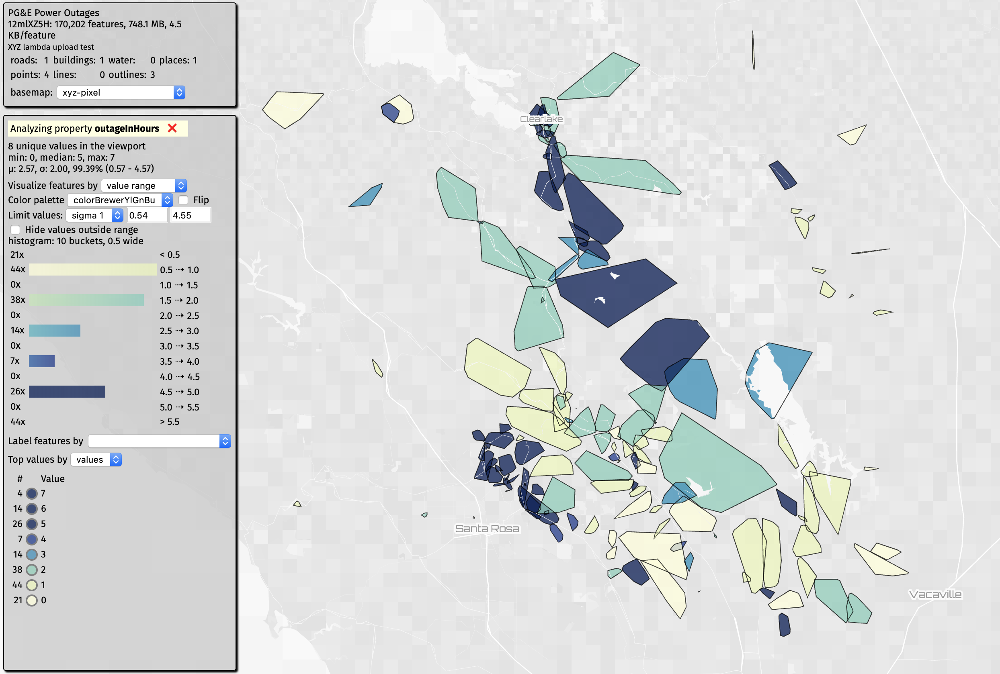

# pge_outage_api_json2geojson

This converts the json from PG&E's outage API to GeoJSON.

This generates points for regions, points for outage events, as well as polygons for outage events (if they exist).

It does some helpful things:

- adds a `name` based on location and PG&E ID
- converts the timestamp into a human readable date string
- and more

This code is now running in an AWS Lambda and is being updated every 10 minutes. Here's a link in XYZ Space Invader:

https://s3.amazonaws.com/xyz-demo/scenes/xyz_tangram/index.html?space=12mlXZ5H&token=AMOsiCPNQ_HWiEAYilO7el8&basemap=xyz-pixel&buildings=1&label=&colors=range&points=4&lines=0&outlines=3&places=1&roads=1&hexbins=0&water=0&tags=outage_polygon+current%2Bcurrent&property=outageInHours&palette=colorBrewerYlGnBu&paletteFlip=false&rangeFilter=1&sort=values&hideOutliers=false#9.1/38.9864/-122.4870

Current outages are tagged with `current`, but once an outage disappears, we tag it with `archived`. We have a few months worth of outages archived -- you might be able to use HERE XYZ property search and use `updatedAt` and `lastFetchTime` to filter by time.

There's a [sample here](outages.geojson), but here's what a record looks like:

    {
      "id": "711261_polygon",
      "type": "Feature",
      "properties": {
        "kind": "outage_polygon",
        "name": "Redwood City 711261",
        "cause": "Our preliminary determination is that your outage was caused by scheduled maintenance work.",
        "hazardFlag": "0",
        "currentEtor": "1574298360",
        "outageNumber": "711261",
        "lastFetchTime": 1574274289183,
        "outageInHours": 1,
        "lastUpdateTime": "1574273224",
        "estCustAffected": "381",
        "outageStartTime": "1574269380",
        "@ns:com:here:xyz": {
          "tags": [
            "outage_polygon",
            "archived"
          ],
          "space": "12mlXZ5H",
          "createdAt": 1574274290605,
          "updatedAt": 1574277893556
        },
        "crewCurrentStatus": "PG&E repair crew is on-site working to restore power.",
        "lastUpdateTimeLocale": "11/20/2019, 6:07:04 PM",
        "outageStartTimeLocale": "11/20/2019, 5:03:00 PM"
      },
      "geometry": {
        "type": "Polygon",
        "coordinates": [
